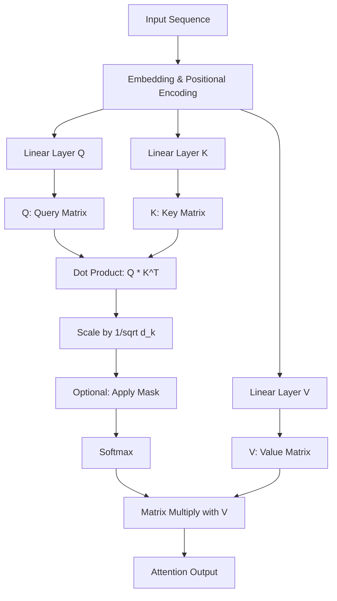
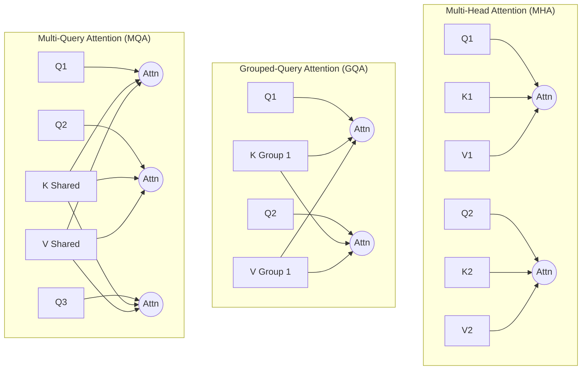
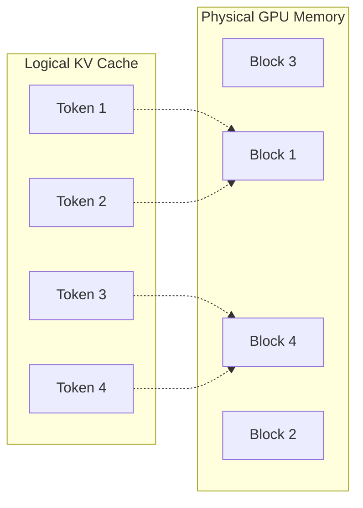
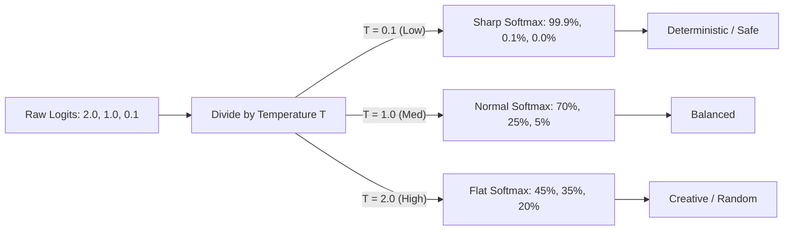
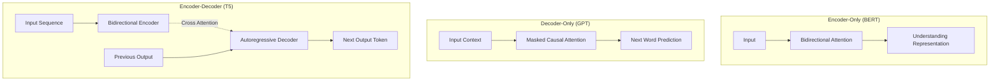

In this post, we'll dive into some fundamental and advanced concepts in modern Machine Learning, particularly focusing on Large Language Models (LLMs). We'll explore the core mechanics of attention, the evolution of attention algorithms, various parallelism strategies for scaling models, the role of temperature in generation, and the main flavors of Transformer architectures.

## 1. The Meaning of Q, K, V in Attention Calculation

The core of the Transformer architecture is the Attention mechanism. It allows the model to weigh the importance of different words in a sequence when processing a specific word.

The concept relies on three vectors for each token: **Query (Q)**, **Key (K)**, and **Value (V)**. This is analogous to a database retrieval system:
- **Query (Q)**: What I am looking for (the current token's representation).
- **Key (K)**: What I have (the representation of other tokens in the sequence).
- **Value (V)**: The actual content or meaning I will return if the Key matches the Query.

The attention score is calculated by taking the dot product of the Query with all Keys, scaling it, applying a softmax to get probabilities, and then multiplying by the Values.

### Mathematical Formula
$$ \text{Attention}(Q, K, V) = \text{softmax}\left(\frac{QK^T}{\sqrt{d_k}}\right)V $$

### Visualizing the Flow



### Code Example (PyTorch)

```python
import torch
import torch.nn.functional as F

def scaled_dot_product_attention(q, k, v, mask=None):
    d_k = q.size(-1)
    # 1. Q * K^T
    scores = torch.matmul(q, k.transpose(-2, -1)) / torch.sqrt(torch.tensor(d_k, dtype=torch.float32))

    # 2. Apply Mask (if any)
    if mask is not None:
        scores = scores.masked_fill(mask == 0, -1e9)

    # 3. Softmax
    attention_weights = F.softmax(scores, dim=-1)

    # 4. Multiply with V
    output = torch.matmul(attention_weights, v)
    return output, attention_weights
```

**Paper Reference:**
* [Attention Is All You Need (Vaswani et al., 2017)](https://arxiv.org/abs/1706.03762)

---

## 2. Multi-Head Attention Variations: MHA, MQA, GQA, and MLA

To improve the original attention mechanism's efficiency, especially regarding the memory footprint of the KV cache during inference, several architectural variations have been introduced.

### Multi-Head Attention (MHA)
The standard approach from the original Transformer. Every Query (Q) head has its own dedicated Key (K) and Value (V) head.
* **Pros:** Maximum expressiveness and model capacity.
* **Cons:** Massive KV cache memory requirement during inference, severely limiting context length and batch size.

### Multi-Query Attention (MQA)
Introduced to drastically reduce KV cache size. Multiple Q heads share a **single** K and V head.
* **Pros:** KV cache memory is reduced by a factor of the number of heads (e.g., 32x smaller). Inference is heavily memory-bandwidth optimized.
* **Cons:** Noticeable degradation in model quality and expressiveness compared to MHA.
* **Reference:** [Fast Transformer Decoding: One Write-Head is All You Need (Shazeer, 2019)](https://arxiv.org/abs/1911.02150)

### Grouped-Query Attention (GQA)
A compromise between MHA and MQA. Q heads are divided into "groups," and each group shares one K and one V head. Used in models like LLaMA 2 and Mistral.
* **Pros:** Achieves almost the same quality as MHA while retaining most of the memory and speed benefits of MQA.
* **Reference:** [GQA: Training Generalized Multi-Query Transformer Models from Multi-Head Checkpoints (Ainslie et al., 2023)](https://arxiv.org/abs/2305.13245)

### Multi-head Latent Attention (MLA)
Pioneered by DeepSeek-V2. Instead of caching large K and V tensors directly, MLA compresses the KV state into a single low-dimensional latent vector. During attention, it dynamically restores the queries and keys, applying Rotary Positional Embeddings (RoPE) efficiently via decoupled vectors.
* **Pros:** Massively compresses KV cache (even smaller than MQA) while performing on par with full MHA.
* **Cons:** More complex to implement and optimize at the kernel level.
* **Reference:** [DeepSeek-V2: A Strong, Economical, and Efficient Mixture-of-Experts Language Model](https://arxiv.org/abs/2405.04434)



### Code Example (GQA Implementation)

```python
import torch
import torch.nn.functional as F

def grouped_query_attention(q, k, v, num_heads, num_kv_heads):
    """
    q shape: [batch, seq_len, num_heads, head_dim]
    k, v shape: [batch, seq_len, num_kv_heads, head_dim]
    """
    batch, seq_len, _, head_dim = q.shape

    # Repeat K and V heads to match the number of Q heads
    # For MHA: num_queries_per_kv = 1
    # For MQA: num_queries_per_kv = num_heads
    # For GQA: 1 < num_queries_per_kv < num_heads
    num_queries_per_kv = num_heads // num_kv_heads

    k = torch.repeat_interleave(k, num_queries_per_kv, dim=2)
    v = torch.repeat_interleave(v, num_queries_per_kv, dim=2)

    # Transpose for attention computation: [batch, num_heads, seq_len, head_dim]
    q = q.transpose(1, 2)
    k = k.transpose(1, 2)
    v = v.transpose(1, 2)

    # Standard scaled dot-product attention
    scores = torch.matmul(q, k.transpose(-2, -1)) / (head_dim ** 0.5)
    attn_weights = F.softmax(scores, dim=-1)
    out = torch.matmul(attn_weights, v)

    return out.transpose(1, 2)
```

---

## 3. Advanced Attention Methods: FlashAttention, PagedAttention, and FlashInfer

As LLMs scaled, standard attention became a bottleneck due to its quadratic time and memory complexity with respect to sequence length. Several techniques have emerged to optimize this.

### FlashAttention
Standard attention materializes the large $S \times S$ attention matrix in High Bandwidth Memory (HBM/VRAM), which is slow. FlashAttention is an **IO-aware** exact attention algorithm. It uses tiling to load blocks of Q, K, and V from slow HBM to fast SRAM, computes attention on chip, and writes the result back, drastically reducing memory reads/writes.

* **Pros:** Exact attention (no approximation loss), significantly faster training and inference, vastly reduced peak memory usage.
* **Cons:** Hardware-specific optimizations are sometimes required; less flexible if custom attention masks/variants are needed without writing custom CUDA kernels.

**Paper Reference:** [FlashAttention: Fast and Memory-Efficient Exact Attention with IO-Awareness (Dao et al., 2022)](https://arxiv.org/abs/2205.14135)

### PagedAttention
When serving LLMs, caching K and V tensors for past tokens (KV Cache) is critical. However, sequence lengths vary, leading to severe memory fragmentation. PagedAttention, introduced by vLLM, borrows the concept of virtual memory and paging from operating systems. It divides the KV cache into non-contiguous blocks (pages), significantly reducing memory waste and allowing much higher batch sizes.

* **Pros:** Nearly eliminates memory fragmentation, allows dynamic batching, enables sharing of KV cache across beam search or parallel sampling.
* **Cons:** Adds a slight overhead in memory management logic and pointer indirection during the attention computation.



**Paper Reference:** [Efficient Memory Management for Large Language Model Serving with PagedAttention (Kwon et al., 2023)](https://arxiv.org/abs/2309.06180)

### FlashInfer
FlashInfer is not just an algorithm, but a highly optimized kernel library tailored for LLM serving. It provides state-of-the-art implementations for variations of attention (like Grouped-Query Attention, cascaded inference, and sparse attention) heavily optimized for different GPU architectures. It often outperforms standard FlashAttention in decoding phases.

* **Pros:** Incredible out-of-the-box performance for serving, supports modern architectural tweaks (like GQA and MLA) flawlessly.
* **Cons:** Another dependency to manage, highly tuned for inference (decoding) and less so for general training compared to standard FlashAttention.

---

## 4. Parallelism Tricks: DP, TP, PP, EP, CP

Training models with billions of parameters requires splitting the workload across many GPUs. Here are the primary parallelism strategies:

### Data Parallelism (DP)
The entire model is replicated on every GPU. Each GPU processes a different mini-batch of data. Gradients are synchronized across GPUs before updating the weights.
* **Pros:** Extremely easy to implement, scales almost linearly with compute.
* **Cons:** Fails if the model itself cannot fit into a single GPU's memory. Network overhead during gradient synchronization can be high.

### Tensor Parallelism (TP)
Individual layers (tensors) are split across multiple GPUs. For example, a large matrix multiplication in a linear layer is split, and GPUs compute partial results that are then communicated.
* **Pros:** Allows training models that exceed a single GPU's memory. Minimizes idle time since GPUs compute simultaneously.
* **Cons:** Requires massive communication bandwidth (e.g., NVLink). Usually restricted to GPUs within a single node.
* **Use Case:** Splitting Attention heads or MLP layers across GPUs on the same node.

### Pipeline Parallelism (PP)
The model is split sequentially. GPU 1 gets layers 1-10, GPU 2 gets layers 11-20, etc. Data flows sequentially through the GPUs like a pipeline.
* **Pros:** Less communication bandwidth required compared to TP. Can scale across multiple nodes easily.
* **Cons:** "Bubble" problem: GPUs might sit idle waiting for earlier stages to pass data.
* **Trick:** To avoid GPUs sitting idle waiting for earlier stages, micro-batching (like in GPipe or PipeDream) is used.

### Expert Parallelism (EP)
Used specifically in Mixture of Experts (MoE) architectures (like Mixtral or GPT-4). The model contains many "expert" sub-networks, and a router decides which experts process which tokens. EP places different experts on different GPUs.
* **Pros:** Allows massive scaling of parameter count without proportionally increasing inference/training compute cost.
* **Cons:** Can suffer from load balancing issues (all tokens routed to one expert, leaving others idle). Heavy cross-node communication overhead during all-to-all expert routing.

### Context Parallelism (CP)
As context windows grow to millions of tokens (e.g., Gemini 1.5 Pro, Llama 3 1M), even a single sequence's KV cache cannot fit on one GPU. Context Parallelism partitions the sequence dimension (the actual input tokens) across multiple GPUs.
* **Pros:** Enables processing extremely long context windows by distributing the attention computation across GPUs.
* **Cons:** Requires complex ring-attention or similar communication patterns so GPUs can exchange KV blocks during the attention pass, adding network latency.
* **Use Case:** Processing 1M+ token contexts (entire books, hour-long videos, massive code repositories) efficiently.

```mermaid
graph TD
    subgraph DP ["Data Parallelism"]
        D_Data1["Data Split 1"] --> D_Model1["Model Replica"]
        D_Data2["Data Split 2"] --> D_Model2["Model Replica"]
    end

    subgraph TP ["Tensor Parallelism"]
        T_Data["Data Batch"] --> T_Layer_Half1["Layer Half 1 - GPU0"]
        T_Data --> T_Layer_Half2["Layer Half 2 - GPU1"]
        T_Layer_Half1 --> T_Combine["Combine Results"]
        T_Layer_Half2 --> T_Combine
    end

    subgraph PP ["Pipeline Parallelism"]
        P_Data["Data Batch"] --> P_GPU1["GPU 0: Layers 1-N"]
        P_GPU1 --> P_GPU2["GPU 1: Layers N+1-2N"]
    end

    subgraph CP ["Context Parallelism"]
        C_Data["Long Sequence"] --> C_Chunk1["Tokens 1-M (GPU 0)"]
        C_Data --> C_Chunk2["Tokens M+1-2M (GPU 1)"]
        C_Chunk1 <--> C_Chunk2
    end
```



**References:**
* [Megatron-LM: Training Multi-Billion Parameter Language Models Using Model Parallelism (Shoeybi et al., 2019)](https://arxiv.org/abs/1909.08053)
* [GPipe: Easy Scaling with Micro-Batch Pipeline Parallelism (Huang et al., 2018)](https://arxiv.org/abs/1811.06965)

### Framework Implementations

Different frameworks have emerged to handle these parallelism strategies across training and inference workloads:

* **PyTorch (Training):** Historically handled Data Parallelism via `DistributedDataParallel` (DDP). For massive models, PyTorch introduced FSDP (Fully Sharded Data Parallelism) which shards weights, gradients, and optimizer states across DP workers, heavily reducing memory overhead.

```python
import torch
from torch.distributed.fsdp import FullyShardedDataParallel as FSDP

model = MyTransformer()
# Wrap the model in FSDP for massive Data/Tensor scaling
fsdp_model = FSDP(model)
```

* **JAX (Training/Inference):** Shines in its ability to easily express parallelism through `pjit` (Partitions JIT). By simply specifying how data and model axes map to hardware meshes, JAX compiler (XLA) automatically partitions the computation.

```python
import jax
import numpy as np
from jax.sharding import Mesh

# Define a 2D hardware mesh (e.g., 2 Data Parallel, 4 Tensor Parallel)
mesh = Mesh(np.array(jax.devices()).reshape(2, 4), ('data', 'model'))

@jax.jit
def train_step(state, batch):
    return update(state, batch)
```

* **vLLM (Inference):** The industry standard for serving. It natively supports Tensor Parallelism (TP) for multi-GPU inference within a single node, and Pipeline Parallelism (PP) for multi-node inference. It is heavily optimized for PagedAttention.

```python
from vllm import LLM

# Run LLaMA on 4 GPUs using Tensor Parallelism
llm = LLM(model="meta-llama/Meta-Llama-3-8B", tensor_parallel_size=4)
output = llm.generate("The meaning of life is")
```

* **SGLang (Inference):** Another high-performance serving framework optimized for complex prompt workflows. It supports TP and introduces RadixAttention to reuse KV caches across multiple requests that share common prefixes (like few-shot prompts).

```python
import sglang as sgl

@sgl.function
def few_shot_qa(s, question):
    # sglang caches this prefix automatically using RadixAttention
    s += "Q: What is 1+1?\nA: 2\n"
    s += "Q: What is 2+2?\nA: 4\n"
    s += f"Q: {question}\nA:" + sgl.gen("answer")
```

* **DeepSpeed (Training):** A library built on top of PyTorch by Microsoft, famous for its Zero Redundancy Optimizer (ZeRO), which essentially acts as advanced Data Parallelism with partitioned model states.

```python
import deepspeed

# deepspeed config defines ZeRO stage (e.g., Stage 3 for parameter partitioning)
ds_config = {"zero_optimization": {"stage": 3}}
model_engine, optimizer, _, _ = deepspeed.initialize(
    args=args, model=model, model_parameters=params, config=ds_config
)
```

---

## 5. Generation Parameters: Context Length, Temperature, and Sampling

When an LLM generates text, its final layer produces "logits" (raw, unnormalized scores) for every word in its vocabulary. These logits are converted into probabilities using a Softmax function. However, generation is controlled by several key parameters, including Context Length, Temperature, and Sampling strategies (Top-K/Top-P).

### Context Length
* **Definition:** The maximum number of tokens an LLM can process in a single request (input prompt + generated output).
* **Importance:** Attention memory requirements scale quadratically (or linearly with newer optimizations) with context length. A larger context length allows the model to "read" entire books, codebases, or long conversational histories.
* **Mechanisms:** Modern models extend context length using tricks like Rotary Positional Embeddings (RoPE) scaling or sparse attention.

### Temperature ($T$)

**Temperature** is a hyperparameter that scales these logits before the Softmax is applied.

$$ p_i = \frac{\exp(z_i / T)}{\sum_j \exp(z_j / T)} $$

* **$T < 1$ (Lower Temperature)**: The distribution becomes sharper. The model becomes more confident, predictable, and deterministic. Useful for coding or factual answers.
* **$T = 1$**: Standard Softmax.
* **$T > 1$ (Higher Temperature)**: The distribution flattens. Lower probability tokens get a higher chance of being picked. The model becomes more creative, diverse, and occasionally hallucinates.



### Sampling Parameters (Top-K and Top-P)

Frameworks like **vLLM** and Hugging Face expose sampling parameters that work alongside temperature to truncate the long tail of low-probability words, preventing the model from generating complete gibberish when highly "creative".

* **Top-K Sampling:** Sorts the vocabulary by probability and only considers the top $K$ most likely tokens. All other tokens are discarded. (e.g., `top_k = 50` means only the 50 best words are considered).
* **Top-P (Nucleus) Sampling:** Sorts the vocabulary by probability and keeps adding words to the candidate pool until the cumulative probability exceeds $P$. (e.g., `top_p = 0.9` means it considers the smallest set of words whose combined probability is 90%).
* **Pros:** Ensures that even at high temperatures, the model never picks statistically absurd tokens.

### Code Example

```python
import numpy as np

def temperature_softmax(logits, temperature=1.0):
    # Scale logits by temperature
    scaled_logits = np.array(logits) / temperature
    # Numerical stability
    exp_logits = np.exp(scaled_logits - np.max(scaled_logits))
    return exp_logits / np.sum(exp_logits)

logits = [2.0, 1.0, 0.1]
print(f"T=0.2 (Low)  : {temperature_softmax(logits, 0.2)}") # [0.993 0.006 0.000]
print(f"T=1.0 (Med)  : {temperature_softmax(logits, 1.0)}") # [0.659 0.242 0.098]
print(f"T=5.0 (High) : {temperature_softmax(logits, 5.0)}") # [0.383 0.313 0.261]
```

---

## 6. Transformer Architectures: Encoder-Only vs. Decoder-Only vs. Encoder-Decoder

The original Transformer was an Encoder-Decoder model, but variations have evolved for specific use cases.

### Encoder-Only Models (e.g., BERT, RoBERTa)
* **Architecture:** Uses only the encoder part of the Transformer. Uses **bidirectional** self-attention (tokens can "look" at both past and future tokens).
* **Objective:** Usually trained via Masked Language Modeling (predicting missing words in a sentence).
* **Pros:** Exceptional at understanding context since it looks at the whole sentence at once.
* **Cons:** Terrible at text generation, since it cannot autoregressively predict tokens without future context.
* **Use Case:** Natural Language Understanding (NLU) tasks like text classification, sentiment analysis, and named entity recognition.
* **Reference:** [BERT: Pre-training of Deep Bidirectional Transformers for Language Understanding](https://arxiv.org/abs/1810.04805)

### Decoder-Only Models (e.g., GPT-3, LLaMA)
* **Architecture:** Uses only the decoder part. Uses **causal (unidirectional) self-attention** (tokens can only "look" at past tokens).
* **Objective:** Autoregressive language modeling (predicting the next token).
* **Pros:** Excellent at open-ended generation and few-shot learning. Highly scalable.
* **Cons:** Lacks bidirectional context, which makes it slightly less efficient at strict classification tasks compared to similarly-sized encoder-only models.
* **Use Case:** Natural Language Generation (NLG), conversational agents, instruction following. This is the dominant architecture for modern LLMs.
* **Reference:** [Language Models are Few-Shot Learners (GPT-3)](https://arxiv.org/abs/2005.14165)

### Encoder-Decoder Models (e.g., T5, BART)
* **Architecture:** Both components. The encoder processes the input bidirectionally, and the decoder generates output autoregressively, attending to the encoder's output via cross-attention.
* **Pros:** Best of both worlds for transformation tasks. Strong understanding of input, strong generation of output.
* **Cons:** Computationally heavier and more complex to train and serve than decoder-only models.
* **Use Case:** Sequence-to-Sequence (Seq2Seq) tasks where input and output lengths differ significantly, such as translation, summarization, and paraphrasing.
* **Reference:** [Exploring the Limits of Transfer Learning with a Unified Text-to-Text Transformer (T5)](https://arxiv.org/abs/1910.10683)



---

## 7. Advanced Inference Optimizations

When deploying LLMs to production, generating tokens one-by-one for multiple users simultaneously introduces unique bottlenecks. Several advanced techniques have emerged to maximize throughput and minimize latency.

### Prefill vs. Decode Phases
LLM generation happens in two distinct phases:
1. **Prefill Phase:** The model processes the entire input prompt at once to compute the initial KV cache and generate the very first token. This is highly parallelizable and compute-bound (heavy matrix multiplications).
2. **Decode Phase:** The model generates subsequent tokens one at a time, reading the KV cache and appending to it. This is highly sequential and memory-bandwidth bound.

You can refer to [LLM Inference at scale with TGI](https://huggingface.co/blog/martinigoyanes/llm-inference-at-scale-with-tgi)

### Chunked Prefill
If a user submits an enormous prompt (e.g., 100k tokens), the prefill phase will take a long time, freezing the GPU and stalling the decode phase for all other active users in the batch.
* **Solution:** **Chunked Prefill** splits the massive prompt into smaller chunks (e.g., 4k tokens each) and interleaves them with the decoding steps of other requests.
* **Pros:** Prevents long prompts from causing latency spikes for concurrent users.

### Continuous Batching (In-Flight Batching)
In traditional batching, the GPU waits for all requests in a batch to finish generating before starting the next batch. Because sequences vary in length, shorter requests sit idle, wasting compute.
* **Continuous Batching** operates at the iteration level. The moment one request finishes, it is evicted from the batch, and a new request is immediately swapped in.
* **Pros:** Drastically increases GPU utilization and overall system throughput. Pioneered by Orca and widely used in vLLM.

### Speculative Decoding (Speculative Execution)
Since the **decode phase** is heavily memory-bandwidth bound, the GPU spends more time moving weights from HBM to SRAM than doing actual math.
* **Mechanism:** A smaller, much faster "draft model" (e.g., a 1B parameter model) quickly guesses the next $K$ tokens. The large, slow "target model" (e.g., a 70B model) then evaluates all $K$ tokens in a single parallel forward pass.
* **Outcome:** If the target model agrees with the draft model's guesses, we get $K$ tokens in the time it usually takes to generate 1. If it disagrees at token $N$, it accepts the first $N-1$ tokens and corrects the $N$-th token.
* **Pros:** Significantly reduces latency (time-to-first-token and time-between-tokens) without changing the final output distribution.
* **Cons:** Requires having a highly accurate, identically-tokenized draft model available.

---
*Happy Learning! Machine Learning moves fast, but these foundational concepts remain critical for understanding how modern models operate under the hood.*

**Generated by AI**
