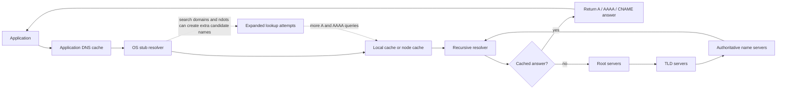
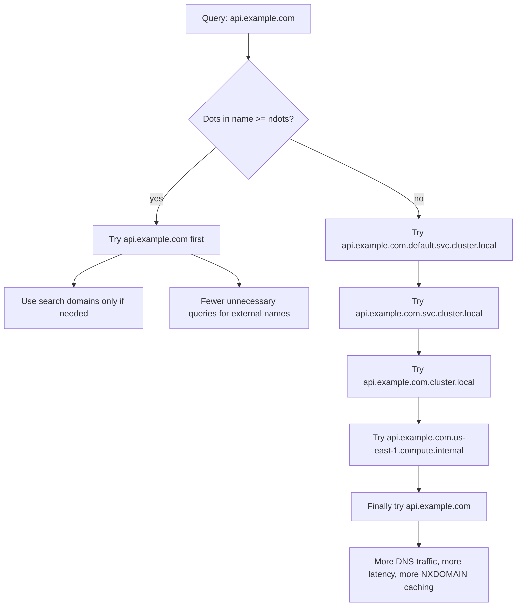

## 1. Introduction

The Domain Name System (DNS) is often referred to as the "phonebook of the internet." It translates human-readable domain names (like `github.com`) into the IP addresses that computers use to identify each other on the network. While its fundamental role is straightforward, the infrastructure behind it is anything but simple. 

When DNS works, it's invisible. When it breaks, everything breaks. Debugging DNS issues today is no longer just checking a single file; it involves understanding a complex chain of components stretching from your local OS to global root servers. 

In this post, we'll cover the modern DNS architecture, how it operates on your local machine versus production servers, and analyze two real-world troubleshooting cases: a DDNS hijacking incident and mysterious DNS timeouts in a cloud environment.

## 2. How DNS Works Nowadays: Global Architecture to Local Machine

### The Global DNS Architecture

The public DNS resolution system is a globally distributed, hierarchical database:
*   **Root Servers (`.`):** The top of the hierarchy. They don't know the IP of `example.com`, but they know which servers handle `.com`.
*   **Top Level Domain (TLD) Servers (`.com`, `.net`, etc.):** These hold the information for the Authoritative Name Servers of specific domains.
*   **Authoritative Name Servers:** The final source of truth. They hold the actual A, AAAA, CNAME, and TXT records for a specific domain.

**Recursive vs. Authoritative Resolvers:**
*   **Authoritative:** Servers that hold the actual records (e.g., Route53, Cloudflare DNS).
*   **Recursive:** Servers that fetch answers for you (e.g., Google's `8.8.8.8`, Cloudflare's `1.1.1.1`, or your ISP's resolver). They traverse the hierarchy (Root -> TLD -> Authoritative) so your machine doesn't have to.

### What Actually Happens During a Lookup

A typical lookup is not a single request. It is a sequence with caching at several layers:

1.  **Application cache:** Browsers, JVMs, Go programs, and connection pools may cache DNS answers independently from the OS.
2.  **OS stub resolver:** The local resolver reads system configuration, search domains, and options such as `ndots`, timeout, retry count, and A/AAAA behavior.
3.  **Recursive resolver cache:** Your ISP, corporate resolver, public DNS resolver, or CoreDNS instance often answers from cache without contacting the global hierarchy.
4.  **Authoritative lookup:** Only on cache miss does the recursive resolver walk from root to TLD to authoritative servers.

This matters when debugging because changing a record at the authoritative server does not mean every client immediately sees it. The effective delay is controlled by TTLs and by caches that may be inside the application, host, node, cluster, network, or upstream resolver.

### Resolution Path Diagram

The complete path usually looks like this:



### Records, TTLs, and Negative Caching

The common records are straightforward, but their operational behavior is easy to overlook:

*   **A / AAAA:** Map a name to IPv4 or IPv6 addresses.
*   **CNAME:** Aliases one name to another name. The resolver must continue resolving the target.
*   **NS:** Delegates a zone to authoritative name servers.
*   **MX:** Points mail delivery to mail exchangers.
*   **TXT:** Stores arbitrary text, often for SPF, DKIM, DMARC, ACME, and ownership verification.
*   **SOA:** Contains zone metadata. Its negative-cache TTL controls how long resolvers can cache `NXDOMAIN` or "no data" responses.

Two practical rules follow from this:

*   Lower a record's TTL *before* a planned migration, not during the migration. Existing caches keep the old TTL until it expires.
*   Treat `NXDOMAIN` as cacheable. A typo or missing record can keep failing for clients even after you add the record.

### DNS on Modern OS: Linux vs. macOS

The way your local machine (the "stub resolver") queries these servers differs significantly depending on the operating system.

#### The Linux Way (Servers, VPS, Cloud)

Linux relies on standard POSIX libraries and system daemons:
*   **`/etc/nsswitch.conf` (Name Service Switch):** This file dictates the order of lookups. Usually, a line like `hosts: files dns` tells the OS to check local files (`/etc/hosts`) *before* making a DNS query.
*   **`/etc/resolv.conf`:** Historically, this file contained the IPs of upstream recursive resolvers. 
*   **The Modern Middleman (`systemd-resolved`):** On modern Linux distributions (like Ubuntu), `/etc/resolv.conf` is usually a symlink (often pointing to `/run/systemd/resolve/stub-resolv.conf`). The OS runs a local caching stub resolver (listening on `127.0.0.53`). Applications query this local service, which then proxies the request to the upstream servers. This setup allows for advanced features like Split DNS and local caching.

#### The macOS Way (Local Development)

macOS does **not** use `nsswitch.conf` or `systemd-resolved`. Apple uses its own System Configuration framework:
*   **`mDNSResponder`:** The core daemon handling both standard DNS and Multicast DNS (Bonjour/`.local`).
*   **`/etc/resolv.conf` is a Lie:** Looking at `/etc/resolv.conf` on a Mac is often misleading. It is kept for legacy POSIX compatibility, but it doesn't always reflect the full, active routing table (especially when using VPNs).
*   **`scutil --dns`:** This is the correct command to view your actual, active DNS routing table on a Mac.
*   **Split DNS trick (`/etc/resolver/`):** Mac developers often use the `/etc/resolver/` directory to route specific top-level domains (like `.docker` or `.test`) to local daemons (like `dnsmasq`) without altering global network settings.

### Useful Debugging Commands

When a DNS issue is intermittent, collect evidence at each layer instead of relying on one command:

```bash
# Ask a specific recursive resolver
dig @1.1.1.1 github.com A

# Trace delegation from root to authoritative servers
dig +trace example.com

# Show TTLs and response metadata
dig example.com A +noall +answer +comments

# Compare IPv4 and IPv6 lookups
dig example.com A
dig example.com AAAA

# macOS: inspect active resolver routing
scutil --dns

# Linux: inspect systemd-resolved state
resolvectl status

# Watch live DNS packets
sudo tcpdump -ni any port 53
```

If `dig` succeeds but the application still fails, suspect application-level caches, search-domain expansion, resolver options, container DNS configuration, or TLS/SNI and HTTP-layer issues that only look like DNS failures.

---

## 3. Case Study 1: DDNS Hijacking and the DDoS Nightmare

### The Scenario
Imagine renting a standard Linux VPS for personal projects. Suddenly, the VPS experiences massive outbound network spikes, performance grinds to a halt, and you receive an abuse alert from your hosting provider stating your server is participating in a Distributed Denial of Service (DDoS) attack.

### Identification & Investigation
1.  **Resource Monitoring:** `top` or `htop` might show high CPU usage from network interrupts, while bandwidth graphs show a massive spike in outbound traffic.
2.  **Traffic Analysis:** Running a quick packet capture (`sudo tcpdump -n udp port 53`) or viewing active flows (`iftop`, `ss -u -a`) reveals a flood of outgoing UDP packets on port 53 aimed at seemingly random IPs. 
3.  **Root Cause Analysis:** You trace the process generating the traffic and discover it belongs to a Dynamic DNS (DDNS) updater script or a vulnerable service you exposed. The service was compromised. Attackers were using your VPS to send spoofed DNS queries to open recursive resolvers. By requesting large DNS records (like `TXT` or `ANY`) and spoofing the source IP to be the *target's* IP, the large responses flood the target. Your VPS became a participant in a **DNS amplification/reflection attack**.

### Resolution & Mitigation
*   **Immediate Response:** Kill the offending process immediately. Temporarily block outgoing port 53 traffic via `iptables` or `ufw` (`sudo ufw deny out 53`) to stop the attack and contain the damage while you investigate.
*   **Fixing the Flaw:** Remove the compromised software, update your packages, and rotate any potentially exposed credentials. 
*   **Long-term Prevention:** 
    *   **Egress Filtering:** Instead of allowing your VPS to talk to any IP on the internet over port 53, restrict outbound DNS queries strictly to trusted resolvers (like `8.8.8.8` or your provider's DNS).
    *   **Anti-spoofing:** Prefer providers and network paths that implement source-address validation. DNS reflection depends on forged source IPs; BCP 38-style filtering reduces the blast radius.
    *   **No Open Recursion:** If you run your own resolver, never expose recursion to the public internet. Authoritative DNS and recursive DNS should be treated as different roles.
    *   **Hardening:** Implement general VPS hardening: disable password authentication for SSH, use `Fail2Ban`, and ensure unnecessary ports are closed.

---

## 4. Case Study 2: Battling DNS Timeouts in the Cloud

### The Scenario
You are running microservices in a highly scaled cloud environment (like Kubernetes on AWS or GCP). Randomly, applications throw errors like `Temporary failure in name resolution` or `DNS lookup failed`. These errors are intermittent and hard to reproduce.

### Investigation & Common Culprits
1.  **The Cloud Architecture:** In Kubernetes, an app's DNS query typically goes: App -> NodeLocal Cache -> CoreDNS Pod -> Cloud Provider VIP (e.g., AWS Route53 Resolver).
2.  **Hitting Limits:** Cloud providers impose hard limits to protect their infrastructure. For example, AWS documents a 1024 packets-per-second quota per network interface for traffic to link-local services, including Route 53 Resolver addresses such as the VPC `.2` resolver and `169.254.169.253` ([AWS docs](https://docs.aws.amazon.com/Route53/latest/DeveloperGuide/resolver-availability-scaling.html)). If a node hosts chatty pods, you can hit this limit silently, causing packet drops.
3.  **The `conntrack` Race Condition:** This is a notorious Linux kernel issue. When an application queries a hostname, `glibc` often sends the A (IPv4) and AAAA (IPv6) queries *simultaneously* over UDP from the same socket. The Linux `netfilter` connection tracking (`conntrack`) module can experience a race condition when processing these concurrent UDP packets, leading to dropped packets and 5-second DNS timeouts.
4.  **Search Domain Amplification:** Kubernetes often injects multiple search domains into `/etc/resolv.conf`. With a high `ndots` value, a simple external name can expand into several attempted queries before the final absolute lookup, multiplying DNS traffic and latency.

### Why `ndots` Matters

`ndots` is one of the most important resolver options in container environments because it controls when a name is treated as already-qualified.

The rule is:

*   If a query name has at least `ndots` dots, the resolver tries it as an absolute name first.
*   If it has fewer than `ndots` dots, the resolver tries the name with each configured search domain first, then tries the absolute name.
*   A trailing dot, such as `api.example.com.`, marks the name as absolute and bypasses search-domain expansion.

On a normal Linux host, `ndots` is often `1`. In Kubernetes, pod `/etc/resolv.conf` commonly looks like this:

```text
search default.svc.cluster.local svc.cluster.local cluster.local us-east-1.compute.internal
options ndots:5
```

With `ndots:5`, even a name that looks fully qualified to a human may not be tried as absolute first. For example, `api.example.com` has two dots, which is fewer than five. The resolver can attempt:

```text
api.example.com.default.svc.cluster.local
api.example.com.svc.cluster.local
api.example.com.cluster.local
api.example.com.us-east-1.compute.internal
api.example.com
```

That is already five candidate names. If the application asks for both A and AAAA records, this can become ten DNS queries for one logical lookup before retries are counted. Under load, those extra `NXDOMAIN` responses and timeouts can be enough to push CoreDNS, NodeLocal DNSCache, or the cloud resolver into packet drops.

Here is the difference visually:



The tradeoff is that Kubernetes sets a high `ndots` value to make short service names ergonomic. A pod can resolve `redis` or `redis.default` through the cluster search path without hardcoding the full service DNS name. That convenience is useful for internal service discovery, but it is expensive for workloads that frequently call external domains.

Practical guidance:

*   For external dependencies, use fully qualified names with a trailing dot when the application accepts them, for example `api.example.com.`.
*   For pods that mostly call external services, consider setting pod-level `dnsConfig.options` with `ndots: "1"` after testing internal service discovery behavior.
*   Use full Kubernetes service names, such as `redis.default.svc.cluster.local`, when you want clarity and fewer search attempts.
*   Do not assume `dig api.example.com` reproduces application behavior exactly. Use `dig +search api.example.com`, `getent hosts api.example.com`, packet captures, or application logs when investigating search-list expansion.
*   Watch CoreDNS metrics for `NXDOMAIN`, latency, and cache hit rate. A high volume of negative responses is often a sign that search-domain expansion is doing unnecessary work.

### Solutions & Best Practices
Understanding the OS-level DNS mechanics helps solve these cloud-scale issues:

*   **NodeLocal DNSCache:** Running a daemonset cache on every node drastically reduces cross-network UDP traffic to CoreDNS and shields you from cloud provider PPS limits.
*   **Tune CoreDNS:** Watch CoreDNS latency, error rate, cache hit ratio, and upstream saturation. Scale replicas, enable caching, and avoid forwarding loops.
*   **Tweaking `/etc/resolv.conf` Options:**
    *   `options single-request-reopen`: This tells the stub resolver to serialize the A and AAAA requests, opening a new socket for the second request. This avoids the UDP `conntrack` race condition.
    *   `options use-vc` (Force TCP): This forces the stub resolver to use TCP instead of UDP. Since TCP is connection-oriented, it bypasses the `conntrack` UDP drops entirely, though it adds slight connection overhead.
    *   `options ndots:1`: For workloads that mostly resolve external FQDNs, reducing `ndots` can cut unnecessary search-domain queries.
*   **Disabling IPv6 Lookups:** If your internal network is IPv4-only, you can often configure your application or OS to completely stop sending AAAA queries, instantly halving your DNS traffic volume.
*   **Use Absolute Names:** In configuration, prefer fully qualified names with a trailing dot where appropriate (for example, `api.example.com.`) to bypass search-domain expansion.
*   **Measure at the Node:** On AWS, inspect `linklocal_allowance_exceeded` with `ethtool` when you suspect link-local throttling. In Kubernetes, also check pod `/etc/resolv.conf`, CoreDNS logs, and node-level packet captures.

## 5. A Practical Troubleshooting Flow

When DNS fails, the fastest path is to narrow the failing layer:

1.  **Is the authoritative data correct?** Query the authoritative name server directly and check record type, TTL, CNAME chain, DNSSEC status, and `NXDOMAIN` behavior.
2.  **Is the recursive resolver returning stale or different data?** Compare multiple resolvers such as your corporate resolver, cloud resolver, `1.1.1.1`, and `8.8.8.8`.
3.  **Is the OS resolver routing the query where you think it is?** Check `resolvectl status` on Linux or `scutil --dns` on macOS, especially under VPN or split-DNS setups.
4.  **Is the application using the OS resolver?** Some runtimes use custom resolvers, cache forever, or resolve names once at startup.
5.  **Is the network dropping packets?** Use packet capture, resolver metrics, CoreDNS metrics, and cloud network counters to distinguish bad answers from missing answers.

## 6. Conclusion

DNS might seem like simple text-to-IP translation, but diving deep reveals a complex, multi-layered architecture. Whether you are setting up a split-DNS environment on your local macOS machine or debugging 5-second timeouts in a massive Kubernetes cluster, understanding the core mechanics—from the global hierarchy down to the OS stub resolver—is essential. 

Monitoring and observing your DNS traffic is just as critical as monitoring CPU or memory. By implementing best practices like egress filtering, local caching, and understanding kernel-level network quirks, you can ensure your infrastructure remains resilient and performant.
